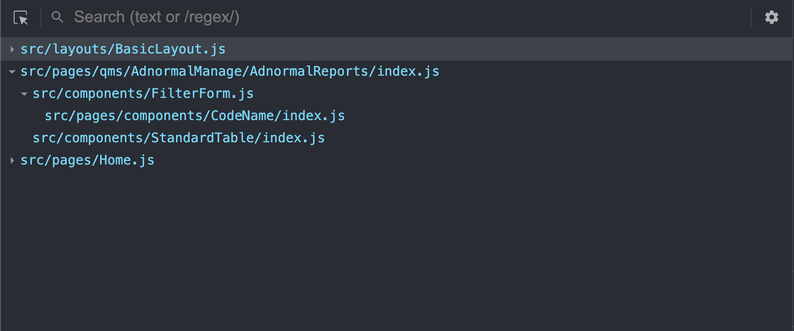

Use path to as displayName easily navigate to the file you are looking for.
As default, it would only set displayName for 'export default unnamed function' unless pass arg to it.



1. Install
```
  npm i -D react-displayname-webpack-plugin
```
2. Add to webpack plugin
```
  new (require('react-displayname-webpack-plugin'))('src') # I'd like to set displayname something like src/../../
```
